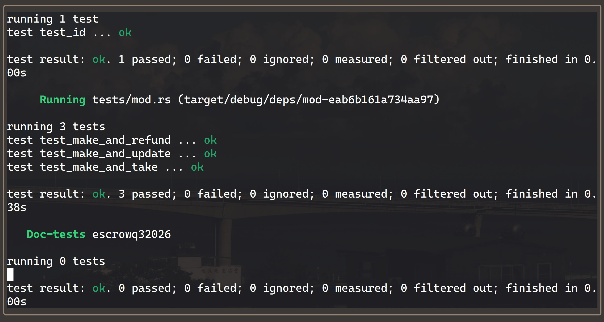

# Escrow Program

**Program ID:** `u6KexT8KmdzPs1uzd2sRDfKr4V5ZTT2GSSku4n7fEWS`

Two parties swap SPL tokens without trusting each other or a third party. The maker deposits token A into a program-owned vault and names how much token B they want back. Any taker holding token B can settle the swap atomically; if nobody does, the maker reclaims the deposit.

## Accounts

Every offer has exactly two program-derived accounts, both keyed to the maker and an arbitrary `seed`, so one maker can run many offers at once.

| Account  | Seeds                          | Type                              | Holds                                             |
| -------- | ------------------------------ | --------------------------------- | ------------------------------------------------- |
| `escrow` | `[b"escrow", maker, seed]`     | `Account<Escrow>`                 | Terms of the swap — 1-byte discriminator + 121    |
| `vault`  | ATA of `escrow` for `mint_a`   | `InterfaceAccount<TokenAccount>`  | The maker's deposited token A                     |

```rust
#[derive(InitSpace)]
#[account(discriminator = 1)]
pub struct Escrow {
    pub seed: u64,
    pub maker: Pubkey,
    pub mint_a: Pubkey,
    pub mint_b: Pubkey,
    pub receive: u64,
    pub bump: u8,
    pub expiration: i64,
}
```

Making the vault an associated token account owned by the `escrow` PDA means the escrow account itself never touches token balances — it is pure terms, and the vault is pure custody. The bump is stored at creation and read back on every later instruction, which avoids re-running `find_program_address` on chain. Account and instruction discriminators are both explicit single bytes rather than Anchor's default eight, trading collision headroom for account size and instruction data.

## Instructions

### `make(seed: u64, deposit: u64, receive: u64, expiration: i64)`

Creates `escrow` and its `vault`, then transfers `deposit` of token A from the maker into the vault. Requires `expiration` in the future, `deposit` and `receive` both nonzero, and `mint_a != mint_b`.

### `take()`

Transfers `receive` of token B from taker to maker, sends the vault's entire token A balance to the taker, then closes the vault and the escrow with the maker as rent destination. Rejects an escrow at or past its expiration. The taker's token A account and the maker's token B account are created on demand via `init_if_needed`, paid for by the taker.

### `refund()`

Returns the vault's balance to the maker and closes both accounts. Deliberately **not** gated on expiration — the maker can withdraw an unfilled offer at any time.

### `update(expiration: i64)`

Moves the deadline. Requires the new `expiration` to be in the future. This is the only mutable field on a live escrow.

## Design notes

**A close destination has to be writable, and Anchor will not infer it.** `take` credits the maker twice — `close = maker` on the escrow, and `maker` as the destination of the vault's `CloseAccount` CPI. Writability is required in both directions of a lamport change; what is asymmetric on Solana is ownership, not writability. Any program may credit an account it does not own, but no account can be touched at all unless the transaction marked it writable. Because Anchor derives account metas straight from the struct, a `maker` without `mut` is emitted read-only, and every client generated from the IDL builds a transaction that cannot succeed. The vault's `CloseAccount` CPI fails first with `PrivilegeEscalation`, since a CPI cannot hand the callee more privilege than the caller holds.

**`receive` is fixed at `make`, and `update` moves only the deadline.** `take` reads the price out of the escrow account at execution time, and the taker signs nothing that pins it. If the maker could rewrite `receive`, they could land an update in front of a pending take and charge whatever they liked — the taker's own transaction would settle at the new price. Restricting `update` to `expiration` removes that at the type level. The alternative, passing a `max_receive` bound into `take`, only works if every client remembers to send a sane one.

**Amounts are validated at `make` because nothing afterward can correct them.** Since `receive` is immutable, an offer created with `receive: 0` is a vault anyone can drain for free, and the maker's only recourse is `refund`. `deposit` and `receive` are therefore both checked against zero at creation, alongside the expiration and distinct-mint checks.

**`take` and `refund` move the vault's whole balance rather than a recorded amount.** The escrow stores `receive` but never the deposit; the vault's own balance is the source of truth. That holds because nothing can reduce it — there is no partial withdrawal, and `refund` closes the offer outright — so the amount a taker sees when they read the account is the amount they get. Anyone topping up the vault only makes the offer better for the taker.

## Errors

| Code | Name              | Cause                                                            |
| ---- | ----------------- | ---------------------------------------------------------------- |
| 6000 | `EscrowExpired`   | `take` called at or after the escrow's expiration                |
| 6001 | `InvalidExpiry`   | `expiration` was not in the future, on `make` or `update`        |
| 6002 | `InvalidAmount`   | `deposit` or `receive` was zero on `make`                        |
| 6003 | `SameMint`        | `mint_a` and `mint_b` were the same mint                         |
| 2006 | `ConstraintSeeds` | Anchor built-in: the supplied escrow doesn't derive from the signer |

## Layout

```
programs/escrowq32026/
├── src/
│   ├── lib.rs                      # declare_id! and the four entrypoints
│   ├── constants.rs                # ESCROW_SEED
│   ├── error.rs                    # EscrowExpired, InvalidExpiry, InvalidAmount, SameMint
│   ├── state.rs                    # Escrow
│   ├── instructions.rs
│   └── instructions/
│       ├── make.rs
│       ├── take.rs
│       ├── refund.rs
│       └── update.rs
└── tests/
    └── mod.rs                      # litesvm integration tests
```

## Building and testing

```bash
anchor build
```

```bash
anchor test
```

Tests run against [litesvm](https://github.com/LiteSVM/litesvm) rather than a local validator, so no `solana-test-validator` process is required. The suite loads the compiled `.so` directly and drives it through each path the program supports.



`mod.rs` covers one full round trip per exit path:

1. `test_make_and_refund` — the vault holds the deposit and is owned by the escrow, the escrow records the seed, maker, both mints and `receive`; after `refund` neither account remains
2. `test_make_and_take` — a separately funded taker settles the swap; the taker ends up with the deposited token A, the maker with `receive` of token B, and both escrow and vault are closed
3. `test_make_and_update` — the deadline moves to the new value while `receive` and `maker` stay put

The update test asserts that `receive` is unchanged, not just that `expiration` moved. That is the property keeping a maker from repricing a pending take, and a test that only checked the deadline would pass just as happily against a version where `update` still rewrote the price.
